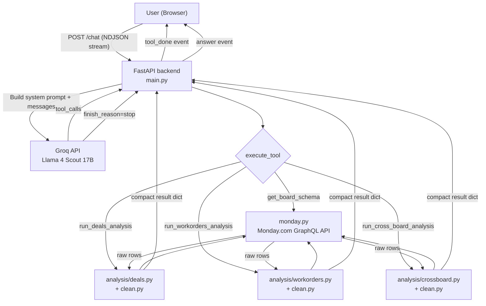

# Technical Analysis — Monday.com BI Agent
**Project:** Skylark Assignment 1 — `monday-chat-mvp`
**Stack:** Python (FastAPI + pandas) · Svelte 4 · Vite · Groq LLM (Llama 4)
**Date:** March 2026

---

## 1. Overview

This project is a **conversational business intelligence agent** that connects to two Monday.com boards — a **Deals board** (sales pipeline) and a **Work Orders board** (project execution) — and lets a founder/executive query both in natural language. The agent uses a tool-calling LLM loop to select and invoke the right analysis function server-side, then streams a formatted answer back to the browser.

---

## 2. System Architecture



The architecture separates concerns cleanly into four layers:

| Layer | Component | Responsibility |
|---|---|---|
| **Transport** | [main.py](file:///c:/Users/ADMIN/Documents/Notes/Vault%201/Vault%201/Projects/Skylark%20Assignment%201/backend/main.py) | HTTP, NDJSON streaming, agent loop |
| **LLM** | Groq / Llama 4 Scout | Tool selection, natural language generation |
| **Data Access** | [monday.py](file:///c:/Users/ADMIN/Documents/Notes/Vault%201/Vault%201/Projects/Skylark%20Assignment%201/backend/monday.py) | Monday.com GraphQL API |
| **Analytics** | [analysis/](file:///c:/Users/ADMIN/Documents/Notes/Vault%201/Vault%201/Projects/Skylark%20Assignment%201/backend/analysis/deals.py#27-65) + [clean.py](file:///c:/Users/ADMIN/Documents/Notes/Vault%201/Vault%201/Projects/Skylark%20Assignment%201/backend/clean.py) | Cleaning, filtering, metric computation |

---

## 3. Backend Deep-Dive

### 3.1 Agent Loop ([main.py](file:///c:/Users/ADMIN/Documents/Notes/Vault%201/Vault%201/Projects/Skylark%20Assignment%201/backend/main.py))

The core is a **`while True` tool-calling loop** in [agent_stream()](file:///c:/Users/ADMIN/Documents/Notes/Vault%201/Vault%201/Projects/Skylark%20Assignment%201/backend/main.py#56-116):

1. A system prompt (built dynamically from [prompts.py](file:///c:/Users/ADMIN/Documents/Notes/Vault%201/Vault%201/Projects/Skylark%20Assignment%201/backend/prompts.py)) is prepended to the conversation history.
2. The full message list is sent to Groq.
3. If `finish_reason == "tool_calls"` → execute all tool calls, append results to history, loop.
4. If `finish_reason == "stop"` → stream the final answer and break.

All events (`tool_start`, `tool_done`, `answer`) are yielded as **NDJSON lines** to the browser, enabling the live "Action Log" panel to update in real time.

**Strengths:**
- The loop is stateless per request — conversation history is sent in full each time, which correctly handles multi-turn context.
- Error handling wraps each tool call independently, so one failing tool call does not kill the entire agent.

**Weaknesses / Risks:**
- The `while True` loop has **no turn limit**. A pathological LLM response could cause an infinite loop or excessive API charges.
- `model="meta-llama/llama-4-scout-17b-16e-instruct"` is a preview model with a non-trivial failure rate. There is no retry logic or fallback model.
- `CORS` is set to `allow_origins=["*"]` — appropriate for development but should be locked down before any production deployment.

### 3.2 Tool Definitions ([tools.py](file:///c:/Users/ADMIN/Documents/Notes/Vault%201/Vault%201/Projects/Skylark%20Assignment%201/backend/tools.py))

Four tools are exposed to the LLM via the OpenAI-compatible function-calling API:

| Tool | Purpose |
|---|---|
| [get_board_schema](file:///c:/Users/ADMIN/Documents/Notes/Vault%201/Vault%201/Projects/Skylark%20Assignment%201/backend/monday.py#23-35) | Introspect Monday.com board columns before querying |
| `run_deals_analysis` | Filter + aggregate the Deals board |
| `run_workorders_analysis` | Filter + aggregate the Work Orders board |
| `run_cross_board_analysis` | Inner join the two boards on Deal Name |

The tool descriptions are written in detail and include concrete examples directly in the JSON. This is a good practice — it significantly reduces LLM hallucination of column names and metric keys.

The system prompt instructs the LLM to **always call [get_board_schema](file:///c:/Users/ADMIN/Documents/Notes/Vault%201/Vault%201/Projects/Skylark%20Assignment%201/backend/monday.py#23-35) first**, establishing a two-step pattern that trades one extra API call for guaranteed column-name correctness.

### 3.3 Monday.com Integration ([monday.py](file:///c:/Users/ADMIN/Documents/Notes/Vault%201/Vault%201/Projects/Skylark%20Assignment%201/backend/monday.py))

All Monday.com communication goes through a single [gql()](file:///c:/Users/ADMIN/Documents/Notes/Vault%201/Vault%201/Projects/Skylark%20Assignment%201/backend/monday.py#7-21) function that sends raw GraphQL and raises on errors. Three access patterns are implemented:

- [get_board_schema()](file:///c:/Users/ADMIN/Documents/Notes/Vault%201/Vault%201/Projects/Skylark%20Assignment%201/backend/monday.py#23-35) — column metadata only
- [get_board_items()](file:///c:/Users/ADMIN/Documents/Notes/Vault%201/Vault%201/Projects/Skylark%20Assignment%201/backend/monday.py#37-55) + [search_board()](file:///c:/Users/ADMIN/Documents/Notes/Vault%201/Vault%201/Projects/Skylark%20Assignment%201/backend/monday.py#57-76) — item-level fetching (currently unused by the agent loop; present for potential future use)
- [get_all_items_as_dicts()](file:///c:/Users/ADMIN/Documents/Notes/Vault%201/Vault%201/Projects/Skylark%20Assignment%201/backend/monday.py#83-115) — combined schema + items in a single GraphQL call, used by the analysis modules

**Hard limit:** The `items_page(limit: 500)` parameter means only the first 500 rows from each board are fetched per request. If either board grows beyond 500 items, results will silently be incomplete. Monday.com's API supports cursor-based pagination that is not yet implemented.

### 3.4 Data Cleaning ([clean.py](file:///c:/Users/ADMIN/Documents/Notes/Vault%201/Vault%201/Projects/Skylark%20Assignment%201/backend/clean.py))

The cleaning layer is the most domain-specific and carefully engineered part of the backend. It handles known data quality issues from the CSV/Monday.com exports:

**Deals board ([clean_deals_df](file:///c:/Users/ADMIN/Documents/Notes/Vault%201/Vault%201/Projects/Skylark%20Assignment%201/backend/clean.py#22-85)):**
- Drops literal duplicate header rows (rows where `Deal Stage == "Deal Stage"`)
- Drops rows with blank Deal Names
- Normalises free-text categoricals (strips whitespace, replaces `"nan"` with `""`)
- Resolves the deal value column name with a fallback list of aliases, stored as `_deal_value`
- Parses two date columns (`Tentative Close Date`, `Close Date (A)`) and derives an `is_overdue` boolean flag

**Work Orders board ([clean_workorders_df](file:///c:/Users/ADMIN/Documents/Notes/Vault%201/Vault%201/Projects/Skylark%20Assignment%201/backend/clean.py#90-172)):**
- Drops fully blank rows (caused by CSV export artifacts)
- Replaces `#VALUE!` strings (Excel formula errors in record `SDPLDEAL-085`) with `NaN`
- Normalises `Billing Status` variants (`"BIlled"` → `"Fully Billed"`, `"Billed- Visit N"` → `"Partially Billed"`)
- Maps five financial columns via a fallback alias system to canonical private names (`_contract_value`, `_billed`, `_collected`, `_receivable`, `_unbilled`)

The [_find_col()](file:///c:/Users/ADMIN/Documents/Notes/Vault%201/Vault%201/Projects/Skylark%20Assignment%201/backend/clean.py#177-188) helper performs first an exact match, then a case-insensitive partial match as a fallback — this is resilient to minor column naming drift between Monday exports.

### 3.5 Analysis Modules ([analysis/](file:///c:/Users/ADMIN/Documents/Notes/Vault%201/Vault%201/Projects/Skylark%20Assignment%201/backend/analysis/deals.py#27-65))

All three modules follow the same pattern:

```
fetch → clean → filter (column + date) → group → compute metrics → return compact dict
```

Raw rows **never leave the module** — only aggregated result dictionaries are returned. This is an explicit architectural choice noted in the docstrings.

**[deals.py](file:///c:/Users/ADMIN/Documents/Notes/Vault%201/Vault%201/Projects/Skylark%20Assignment%201/backend/analysis/deals.py) metrics:**
- [count](file:///c:/Users/ADMIN/Documents/Notes/Vault%201/Vault%201/Projects/Skylark%20Assignment%201/backend/analysis/deals.py#242-254), `total_value`, `avg_value`, `null_value_count`
- `overdue_count` (uses the `is_overdue` flag from [clean.py](file:///c:/Users/ADMIN/Documents/Notes/Vault%201/Vault%201/Projects/Skylark%20Assignment%201/backend/clean.py))
- [win_rate](file:///c:/Users/ADMIN/Documents/Notes/Vault%201/Vault%201/Projects/Skylark%20Assignment%201/backend/analysis/deals.py#190-208) (Won / (Won + Dead), with a bulk-import caveat note)
- `weighted_pipeline_value` (deal value × Closure Probability weight: High=0.8, Medium=0.5, Low=0.2)
- `avg_deal_age_days` / `max_deal_age_days`

**[workorders.py](file:///c:/Users/ADMIN/Documents/Notes/Vault%201/Vault%201/Projects/Skylark%20Assignment%201/backend/analysis/workorders.py) metrics:**
- [count](file:///c:/Users/ADMIN/Documents/Notes/Vault%201/Vault%201/Projects/Skylark%20Assignment%201/backend/analysis/deals.py#242-254), `total_contract_value`, `total_billed`, `total_collected`, `total_receivable`, `total_unbilled`
- `billing_coverage` (billed / contract value %)
- `collection_rate` (collected / billed %)

**[crossboard.py](file:///c:/Users/ADMIN/Documents/Notes/Vault%201/Vault%201/Projects/Skylark%20Assignment%201/backend/analysis/crossboard.py):**
- Joins on `Deal Name` ↔ `Deal name masked` (case-insensitive, trimmed)
- Computes `match_count`, `unmatched_deals_count`, `orphaned_wo_count`
- Computes `total_deal_value`, `total_wo_value`, `value_realization_rate`
- Explicitly excludes known orphaned WOs (`golden fish`, `octopus`, `whale`, `turtle`, `dolphin`, `gg go`) from join contamination

### 3.6 System Prompt ([prompts.py](file:///c:/Users/ADMIN/Documents/Notes/Vault%201/Vault%201/Projects/Skylark%20Assignment%201/backend/prompts.py))

The prompt is generated at call-time with board IDs injected from environment variables. It encodes:

- **Persona**: BI agent for a drone/LiDAR/photogrammetry founder
- **Workflow**: Always schema-first, never ask permission, retry on error
- **Data cleaning rules** mirroring [clean.py](file:///c:/Users/ADMIN/Documents/Notes/Vault%201/Vault%201/Projects/Skylark%20Assignment%201/backend/clean.py) (kept in sync manually — a potential drift risk)
- **Response format**: Headline → Breakdown → Callouts → Data Notes, with strict formatting rules

The prompt is well-structured and operationally mature. One fragility: the cleaning rules are duplicated between the prompt and [clean.py](file:///c:/Users/ADMIN/Documents/Notes/Vault%201/Vault%201/Projects/Skylark%20Assignment%201/backend/clean.py), meaning a data update requires changes in two places.

---

## 4. Frontend Deep-Dive ([App.svelte](file:///c:/Users/ADMIN/Documents/Notes/Vault%201/Vault%201/Projects/Skylark%20Assignment%201/frontend/src/App.svelte))

The entire frontend is a single Svelte component (~735 lines including styles). It implements:

- **NDJSON stream reader**: Manually implemented with a `TextDecoder` and line-buffer — correctly handles chunks that split across JSON boundaries.
- **Chat UI**: Bi-directional message bubbles, welcome screen, `marked.js` for Markdown rendering in assistant messages.
- **Action Log panel**: A 300px side panel showing live `tool_start`/`tool_done` events with animated status indicators (pulsing amber → green).
- **Reset Chat**: Clears `messages`, `actionLog`, and `input` state.
- **Keyboard handling**: Enter sends, Shift+Enter allows newlines.
- **API URL**: Resolved from `import.meta.env.PUBLIC_API_URL` at build time, falling back to `http://localhost:8000`.

**Design:** Dark mode (`#0f1117` background), Indigo/Violet (`#6366f1`/`#8b5cf6`) accent, Inter font, custom CSS throughout. No UI framework. The visual quality is clean and functional for an internal tool.

**Weaknesses:**
- **No conversational context boundary**: The full message history is sent to the backend on every request. For long conversations this will eventually hit the model's context limit with no truncation or graceful degradation.
- **No response cancellation**: Once a request is in-flight, the user cannot cancel it — there's no `AbortController` hooked up.
- **`marked()` without sanitization**: `{@html marked(msg.content)}` renders raw HTML. For an internal tool with a trusted LLM backend this is low-risk, but it is an XSS surface if the model is ever prompted to emit HTML tags.

---

## 5. Data Sources

Two CSV datasets are included in `datasets/`:

| File | Description |
|---|---|
| `Deal funnel Data.xlsx - Deal tracker.csv` | Deals board export (~34 KB) |
| `Work_Order_Tracker Data.xlsx - work order tracker.csv` | Work Orders board export (~49 KB) |

These appear to be the static reference exports used during development and for the analysis evaluation script (`eval_bi.py`). The production system fetches live from Monday.com API.

---

## 6. Dependency Summary

| Layer | Package | Version Pinning |
|---|---|---|
| Backend runtime | `fastapi`, `uvicorn`, `groq`, `httpx`, `python-dotenv`, `pandas` | **None** — [requirements.txt](file:///c:/Users/ADMIN/Documents/Notes/Vault%201/Vault%201/Projects/Skylark%20Assignment%201/backend/requirements.txt) has no version pins |
| Frontend | `svelte@^4`, `vite@^5`, `@sveltejs/vite-plugin-svelte@^3` | Caret ranges |
| Frontend runtime | `marked@^9` | Caret range |

The complete absence of version pins in [requirements.txt](file:///c:/Users/ADMIN/Documents/Notes/Vault%201/Vault%201/Projects/Skylark%20Assignment%201/backend/requirements.txt) is a reliability risk — a breaking change in any dependency will affect future installs silently.

---

## 7. Known Limitations and Issues

| # | Issue | Severity | Location |
|---|---|---|---|
| 1 | **No pagination** — Monday.com queries capped at 500 items | High | `monday.py:43,93` |
| 2 | **No agent turn limit** — infinite loop risk | Medium | `main.py:63` |
| 3 | **No dependency version pins** | Medium | [requirements.txt](file:///c:/Users/ADMIN/Documents/Notes/Vault%201/Vault%201/Projects/Skylark%20Assignment%201/backend/requirements.txt) |
| 4 | **Wildcard CORS** | Medium | `main.py:22` |
| 5 | **Duplicate data cleaning rules** in prompt & [clean.py](file:///c:/Users/ADMIN/Documents/Notes/Vault%201/Vault%201/Projects/Skylark%20Assignment%201/backend/clean.py) | Medium | [prompts.py](file:///c:/Users/ADMIN/Documents/Notes/Vault%201/Vault%201/Projects/Skylark%20Assignment%201/backend/prompts.py), [clean.py](file:///c:/Users/ADMIN/Documents/Notes/Vault%201/Vault%201/Projects/Skylark%20Assignment%201/backend/clean.py) |
| 6 | **No abort/cancel** for in-flight requests | Low | [App.svelte](file:///c:/Users/ADMIN/Documents/Notes/Vault%201/Vault%201/Projects/Skylark%20Assignment%201/frontend/src/App.svelte) |
| 7 | **No context window management** for long conversations | Low | [App.svelte](file:///c:/Users/ADMIN/Documents/Notes/Vault%201/Vault%201/Projects/Skylark%20Assignment%201/frontend/src/App.svelte), [main.py](file:///c:/Users/ADMIN/Documents/Notes/Vault%201/Vault%201/Projects/Skylark%20Assignment%201/backend/main.py) |
| 8 | **`marked()` without HTML sanitization** | Low | `App.svelte:196` |
| 9 | **No retry logic** on Groq API errors | Low | `main.py:64` |
| 10 | **[apply_column_filters](file:///c:/Users/ADMIN/Documents/Notes/Vault%201/Vault%201/Projects/Skylark%20Assignment%201/backend/analysis/workorders.py#62-71) is duplicated** in [deals.py](file:///c:/Users/ADMIN/Documents/Notes/Vault%201/Vault%201/Projects/Skylark%20Assignment%201/backend/analysis/deals.py) and [workorders.py](file:///c:/Users/ADMIN/Documents/Notes/Vault%201/Vault%201/Projects/Skylark%20Assignment%201/backend/analysis/workorders.py) | Low | [analysis/](file:///c:/Users/ADMIN/Documents/Notes/Vault%201/Vault%201/Projects/Skylark%20Assignment%201/backend/analysis/deals.py#27-65) |

---

## 8. Recommendations

### 🔴 High Priority

1. **Implement Monday.com pagination.** Add cursor-based fetching in [get_all_items_as_dicts()](file:///c:/Users/ADMIN/Documents/Notes/Vault%201/Vault%201/Projects/Skylark%20Assignment%201/backend/monday.py#83-115):
   ```python
   # Use items_page with cursor loop:
   # items_page(limit: 500) { cursor, items { ... } }
   # Then: items_page(limit: 500, cursor: "...") { ... }
   ```

2. **Pin all backend dependencies** with exact versions in [requirements.txt](file:///c:/Users/ADMIN/Documents/Notes/Vault%201/Vault%201/Projects/Skylark%20Assignment%201/backend/requirements.txt) (or switch to `pyproject.toml` with `uv`/`pip-compile`).

### 🟡 Medium Priority

3. **Add a max-turn guard** to the agent loop:
   ```python
   MAX_TURNS = 8
   for _ in range(MAX_TURNS):
       ...
   else:
       yield json.dumps({"type": "answer", "content": "⚠️ Agent exceeded max tool calls."}) + "\n"
   ```

4. **Consolidate the data cleaning rules.** The prompt's cleaning section should be auto-generated from constants in [clean.py](file:///c:/Users/ADMIN/Documents/Notes/Vault%201/Vault%201/Projects/Skylark%20Assignment%201/backend/clean.py) (e.g., `ORPHANED_WOS`, `HEADER_LITERALS`) rather than maintained separately.

5. **Lock down CORS** to the production frontend origin before any public deployment.

### 🟢 Low Priority / Nice-to-Have

6. **Add `AbortController`** to `sendMessage()` so requests can be cancelled mid-stream.

7. **Extract the shared [apply_column_filters](file:///c:/Users/ADMIN/Documents/Notes/Vault%201/Vault%201/Projects/Skylark%20Assignment%201/backend/analysis/workorders.py#62-71) + [apply_date_filter](file:///c:/Users/ADMIN/Documents/Notes/Vault%201/Vault%201/Projects/Skylark%20Assignment%201/backend/analysis/deals.py#81-114) functions** from [deals.py](file:///c:/Users/ADMIN/Documents/Notes/Vault%201/Vault%201/Projects/Skylark%20Assignment%201/backend/analysis/deals.py)/[workorders.py](file:///c:/Users/ADMIN/Documents/Notes/Vault%201/Vault%201/Projects/Skylark%20Assignment%201/backend/analysis/workorders.py) into a shared `analysis/shared.py` module to avoid the duplication.

8. **Add `DOMPurify`** to sanitize the `marked()` output in [App.svelte](file:///c:/Users/ADMIN/Documents/Notes/Vault%201/Vault%201/Projects/Skylark%20Assignment%201/frontend/src/App.svelte).

9. **Add a rolling window** on the message history sent to the backend (e.g., last N turns) to prevent context overflow for very long sessions.

---

## 9. Codebase Quality Summary

| Dimension | Rating | Notes |
|---|---|---|
| **Architecture** | ⭐⭐⭐⭐½ | Clean separation of concerns, good layering |
| **Data cleaning** | ⭐⭐⭐⭐⭐ | Thorough, well-documented, handles real-world data messiness |
| **API design** | ⭐⭐⭐⭐ | Good tool schema design with rich descriptions |
| **Prompt engineering** | ⭐⭐⭐⭐ | Operationally mature; duplication is the main weakness |
| **Frontend** | ⭐⭐⭐½ | Clean and functional; a few missing polish items |
| **Reliability** | ⭐⭐⭐ | No pagination, no turn limit, no version pins |
| **Security** | ⭐⭐⭐ | Wildcard CORS + no HTML sanitization are the main gaps |

**Overall: a well-designed MVP** with clearly documented domain logic and a clean agentic architecture. The primary gaps are infrastructure-level (pagination, dependency pinning, CORS) rather than architectural — the core design is solid.
